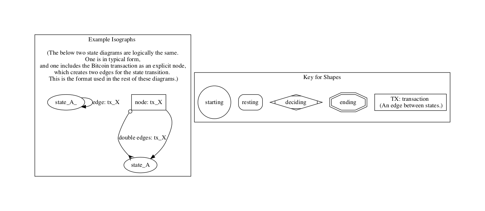
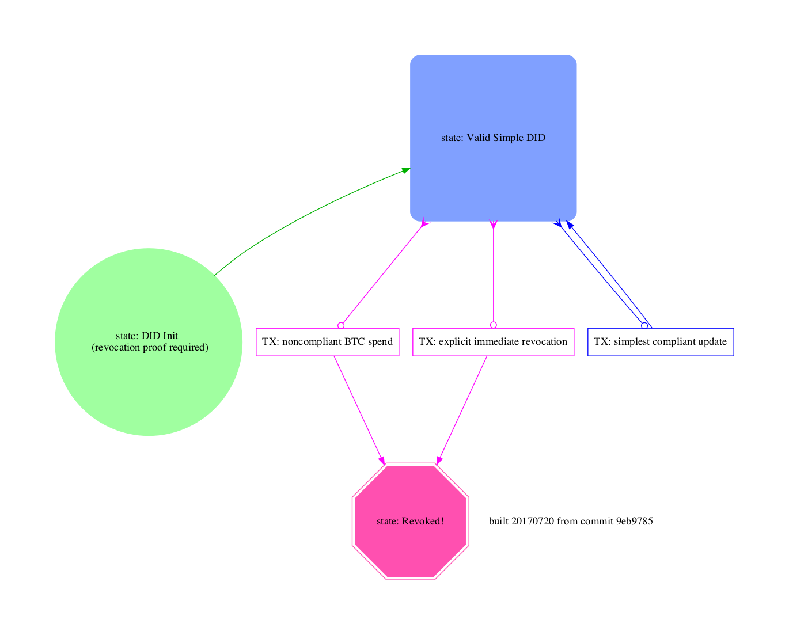
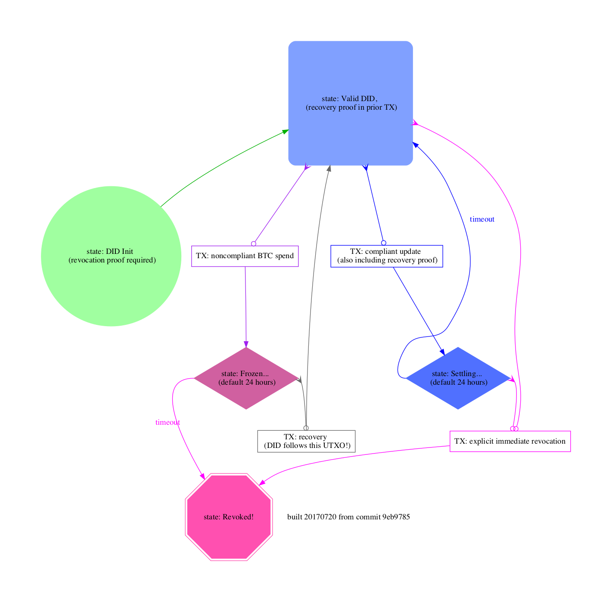
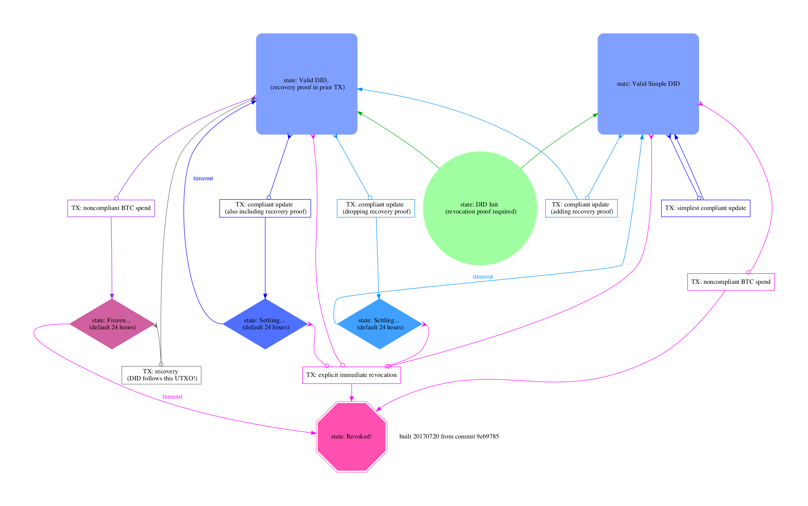

# btcr-hackathon / did:btcr state diagrams

### purpose of the state diagrams

The purpose is generally the same as documenting any state machine:
help visualize transitions and make sure all of them are covered.

### how to read the diagrams

Key [(or as svg)](images/btcr-state-diagram-key.svg):

### the diagrams

The inline images are grungy PNGs, because github [won't present SVG images inline](https://github.com/github/markup/issues/556).  It's possible to [link them from an external site](https://rawgit.com/WebOfTrustInfo/btcr-hackathon/master/docs/state-diagrams/images/btcr-state-diagram-simple.svg), however that introduces another dependency for uptime and privacy.  It's also possible to install the SVGs on WebOfTrustInfo [gh-pages](https://help.github.com/articles/configuring-a-publishing-source-for-github-pages/#enabling-github-pages-to-publish-your-site-from-master-or-gh-pages), but that requires asking someone to push a button.

Simple [(or as SVG)](images/btcr-state-diagram-simple.svg):

Recovery [(or as SVG)](images/btcr-state-diagram-recovery.svg):

All (or as SVG)](images/btcr-state-diagram-all.svg):

### open questions

* Is the user's "explicit immediate revocation" a static transaction
  that can be outsourced to an external monitor?

### differences from UML protocol state machines

[example of UML](http://www.uml-diagrams.org/protocol-state-machine-diagrams.html)

* Like a UML protocol state machine, all of the states and all of the
  transition messages are represented.

* Unlike the more typical diagrams, this one uses different shapes for
  different states.

* Unlike the more typical diagrams, this one focuses on the
  transactions that may occur in the blockchain, giving each its own
  rectangular node, at the expense of drawing the protocol's
  "transition edge" in two pieces.  When a transition edge is split in
  this way, the first half ends in a characteristic hollow dot instead
  of an arrow.

* Some transition edges are provoked by a timeout, and these do not
  require extra pieces to draw.

* Color is used to separate various concerns.  Better colors would be
  nice.

* This diagram focuses on threats to users of the protocol, giving
  attack scenarios their own transition edges (always colored red),
  even when they duplicate the form of state changes that users would
  intentionally initiate.

* It is possible to view multiple variants of compliant DIDs on the
  same diagram.

### advantages of using graphviz with this CPP mechanism

* Graphviz lays this out automatically.

* It avoids a source of errors in copying node information between
  files, at the cost of maintaining CPP ifdefs.

* The clusters and nodes offer writing space, where necessary.

* For slideshow effects, the CPP mechanism offers control over turning
  off any of the layers separately, while leaving nodes in their same
  position in the image.  This requires setting existing nodes to
  invisible, using a CPP variable that is not yet implemented.

### dependencies

* gnu make
* a C compiler's cpp
* graphviz

### graphviz packages

https://packages.debian.org/stable/graphviz

https://packages.ubuntu.com/search?keywords=graphviz

https://github.com/macports/macports-ports/blob/master/graphics/graphviz/Portfile

http://www.graphviz.org/Download.php

### building the diagram images

`make all`
