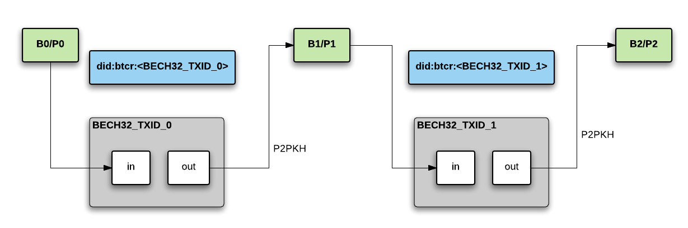

## Creating a BTCR DID

- Create Bitcoin address and private key pair (`B0`/`P0`)
    - This is just for bootstrapping the first tx
- Create Bitcoin address and private key pair (`B1`/`P1`)
- Create `DDO_1` containing supported public keys
- Sign `DDO_1` with `P1`
- Make `DDO_1` available at some URI
- Create Bitcoin transaction as follows:
	- `OP_RETURN` points to `DDO_1`
	- Output is `B1`
	- Signing key is `P0`
- Issue TX, yieling `TXID1`

At this point we have a DID of the format: 
```
did:btcr:<txid1>
```




## Verify/lookup keys

- Given a DID, we know txid (`did:btcr:<txid>`)
- Look up transaction. Is output spent?
    - if so, keep following transactions until an unspent output is found
- DDO address is given the `OP_RETURN` field of the transaction corresponding to unspent output


## Rotating keys

- Update `DDO_i`, sign with `Pi`
- Create new tx like above, but send dust amount to `Bi`
- Sign tx with `P(i-1)`
